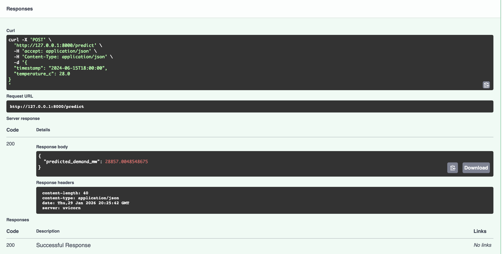

# Power Demand Forecast TR — Baseline Forecasting + FastAPI Inference



[](https://github.com/ozleyisyavuz/power-demand-forecast-tr/actions/workflows/ci.yml)

> **Highlights:** 14-day holdout ile **%1.69 MAPE**, FastAPI inference (`/predict`), pytest + GitHub Actions CI (✅)

---

## Özet (Abstract)
Elektrik talebi tahmini, enerji üretim planlaması, dengeleme maliyetlerinin azaltılması ve şebeke güvenilirliğinin artırılması açısından kritik bir zaman serisi problemidir. Bu çalışma; saatlik elektrik talebini, zaman tabanlı değişkenler (saat, haftanın günü, hafta sonu) ve dış sıcaklık üzerinden tahmin eden **tekrarlanabilir** bir baseline iş akışını sunar. Proje yalnızca model performansına odaklanmaz; aynı zamanda “modeli çalıştır, test et, servis et” yaklaşımıyla **uygulanabilir (deployable) bir ML sistemi** örneği üretir.

Sunulan çözüm üç temel katmandan oluşur:
1. **Veri üretimi (demo/sentetik):** Saatlik gözlemler; günlük döngü, hafta sonu etkisi, sıcaklık ve gürültü bileşenleriyle oluşturulur.
2. **Modelleme:** Özellik çıkarımı (feature engineering) + denetimli öğrenme ile model eğitimi yürütülür.
3. **Servisleştirme ve kalite güvencesi:** FastAPI ile tahmin servisi (`/predict`) sağlanır; pytest testleri ve GitHub Actions CI ile otomatik doğrulama yapılır.

Bu sayede proje, yalnızca “notebook çıktısı” değil; **API üzerinden kullanılabilir, tekrar üretilebilir ve CI ile doğrulanmış** bir örnek enerji talep tahmin sistemi sunar.

---

## Sonuçlar (Results)
Değerlendirme, zaman serilerinde sık görülen “gelecek bilgisi sızıntısını (data leakage)” azaltmak için **zaman sıralı holdout** yaklaşımıyla yapılmıştır. Veri kronolojik olarak sıralanır; son **14 gün (14×24 saat)** doğrulama (validation) seti olarak ayrılır. Model, yalnızca geçmiş veriyi kullanarak doğrulama dönemini tahmin eder.

### Değerlendirme Metriği
- **MAPE (%) — Mean Absolute Percentage Error**
  - Yorum: MAPE ne kadar düşükse, tahminlerin hedef değere yüzde olarak ortalama sapması o kadar küçüktür.

### Nicel Performans
- **Validation MAPE (14-day holdout): 1.69%**

### Sonucun Yorumu
- **Düşük hata oranı:** %1.69 MAPE, doğrulama döneminde tahminlerin ortalama olarak hedef talebin yaklaşık %1.69’u kadar saptığını gösterir (sentetik veri senaryosu altında).
- **Zaman serisi disiplini:** Rastgele train/test ayrımı yerine “son 14 gün holdout” kullanımı problemi gerçek dünyaya daha yakın simüle eder.
- **Sistem seviyesinde kanıt:** Sonuç yalnızca metrik değil; aynı zamanda
  - FastAPI ile **çalışan tahmin servisi** (`/predict`)
  - pytest ile **otomatik test**
  - GitHub Actions ile **CI doğrulaması (yeşil)**

### Tekrarlanabilirlik (Reproducibility)
Aynı veri üretim parametreleri ve seed ile:
- `make_dataset` → veri üretimini tekrarlar,
- `train` → model eğitimini tekrarlar,
- `uvicorn` → aynı API arayüzünü ayağa kaldırır.

> Not: Veri sentetik olduğu için metrik, veri üretim fonksiyonundaki parametre/seed değişimlerine duyarlıdır. Bu repo “gösterilebilir bir baseline + üretime yakın ML iskeleti” sunmayı hedefler.

---

## Yöntem (Methodology)

### Veri Üretimi
`make_dataset.py`, saatlik bir zaman dizisi oluşturur ve talebi etkileyebilecek bileşenleri simüle eder:
- Gün içi döngü (hourly seasonality)
- Hafta sonu etkisi
- Sıcaklık tabanlı etki + rastgele gürültü

Çıktı:
- `data/processed/demand.csv`

### Kullanılan Özellikler (Features)
- `hour` (0–23)
- `dayofweek` (0–6)
- `is_weekend` (0/1)
- `temperature_c` (float)

### Model
Baseline olarak scikit-learn tabanlı regresyon yaklaşımı kullanılır:
- `dayofweek` için One-Hot Encoding
- `HistGradientBoostingRegressor` (baseline)

Eğitim çıktısı:
- `models/model.joblib`

---

## Proje Yapısı (Repository Layout)
```text
.github/workflows/ci.yml          # CI: pytest
src/power_demand_forecast/
  app/main.py                     # FastAPI uygulaması
  data/make_dataset.py            # Sentetik veri üretimi
  models/train.py                 # Eğitim + değerlendirme + model kaydı
tests/test_api.py                 # Basit API testi
requirements.txt
pytest.ini
README.md


